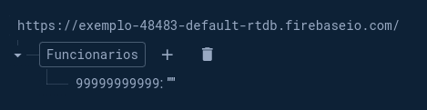

# Cadastro de Funcionários

Sistema feito em **Python** e **Html** utilizando o framework flask. Construido com o único objetivo de treinar e estudar. Estrutura do HTML foi gerado utilizando o **Copilot**.


## Como utilizar?


Crie sua lista de cargos **(Pré definido em 5, devendo ser editado em ```app/templates/definir_cargos.html```)**

```python
  cargos = [ 
    Heart.Cargos("Caixa", 1500),
    Heart.Cargos("Gerente", 5000),    
    Heart.Cargos("Faxineiro", 1000),
    Heart.Cargos("Vendedor", 2000),
    Heart.Cargos("Diretor", 10000)
]
```
Abra o ```app/__init__.py``` e subistitua o **Nome** e o **ID** do firebase.
```python
  empresa = Heart.Empresa(
    nome="Nome da Empresa",
    link_fb='ID do Firebase',
    cargos=Lista_Cargos
)
```
No **Firebase** monte uma sequência da seguinte forma:



Agora é só executar o ```run.py```.

## Stack utilizada

**Front-end:** HTML, Flask

**Back-end:** Python, Flask

